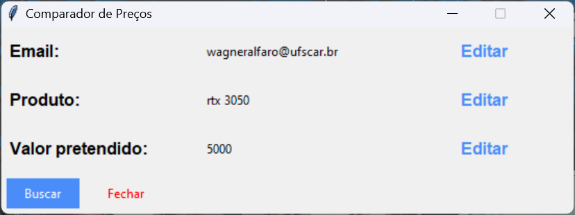
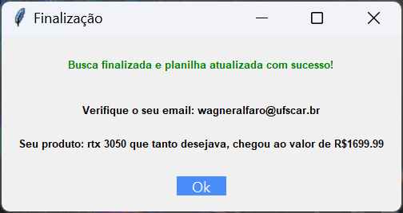
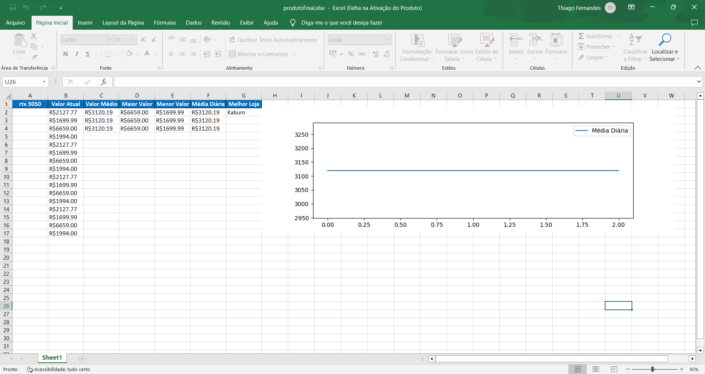

# Comparador de preços com Web Scraping

## Conceito do projeto
O projeto em questão tem como objetivo demonstrar o funcionamento de um Bot de web scraping o qual possui como premissa a realização da coleta de dados da web de maneira totalmente automatizada e a estruturação desses dados para melhor manejo da informação, além disso, haverá a implementação do robô em questão para que este consiga obter valores de produtos na internet. Ademais, vale salientar que é cada vez mais interessante esta estratégia de acesso aos dados pela gigantesca quantidade de informação presente na internet, viabilizando a criação de melhores estratégias para lidar com as experiências dos usuários e até mesmo para o próprio crescimento das empresas. 
  
## Implementação e recursos
Durante a Implementação do robô os principais recursos utilizados foram: a plataforma de código aberto Anaconda 3 aliado ao Jupyter Notebook para o desenvolvimento do código assim como a organização do mesmo, as bibliotecas Openpyxl, Pandas para que se viabilizasse a manipulação de tabelas em que se estruturam os dados gerados pelo Bot, a biblioteca Selenium como principal ferramenta para automação dos testes em navegadores web, as bibliotecas Matplotlib, Seaborn para a construção do gráfico gerados com os dados coletados e por fim a biblioteca Tkinter que possibilitou toda a progressão quanto as interfaces de início e de final do programa.

## Passo a passo
Sob tal lógica, o passo-a-passo para o desdobramento do projeto foi dado por: processo de criação dos prompts, ou seja, das interfaces para recolher as informações que o usuário deseja buscar e também a janela que “retorna” o devido funcionamento da aplicação, com um feedback de suas buscas. Após isso, foi elaborado o código que proporciona a obtenção dos valores de um site, ou por melhor dizer o próprio web scraping,  e concomitantemente manipula os dados inseridos e realiza os cálculos das métricas adequadamente. Em adição, foi desenvolvida uma Newsletter que irá informar o usuário que o produto analisado pelo robô a seu pedido está em seu preço desejado.

## Execução e como utilizar?
A utilização da aplicação é bem intuitiva! Basta o usuário baixar os arquivos do repositório e “rodar” o arquivo executável do programa, inserindo os dados nos campos requisitados e aguardando o trabalho do Bot. Há outra maneira de utilizar a aplicação, menos intuitiva porém funcional de mesmo modo, onde são baixados os arquivos e há a compilação e execução do próprio código fonte.

## Bugs/problemas conhecidos
Os Bugs e problemas conhecidos de nosso projeto cerceiam a possibilidade de alterações de pathing, seja pela manutenção dos sites ou alterações nestes, e a necessidade de "reinicializar" a planilha incial quando for necessário alterar um produto, ou seja, quando se deseja procurar um produto diferente.

## Autores
* Erik Gabriel Rodrigo da Silva ([EriikGabriel](https://github.com/EriikGabriel)) - Implementador
* Rafael Mori Pinheiro ([Rafael-Mori-2022](https://github.com/Rafael-Mori-2022)) - Documentação
* Thiago Kraide de Lima Fernandes ([tkraide](https://github.com/tkraide)) - Implementador

## Imagens/screenshots
  
  
  